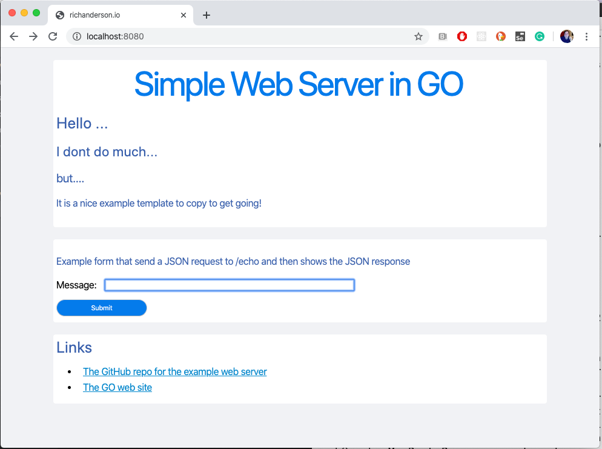

# Simple GO Web Server

A simple GO web server that serves static html pages from a public directory and exposes a simple JSON API. The example API is calle by the index.html page.

## Build and run the web server locally

Build the webserver and then run the web server:

```bash
go build *.go
./app
```

You can now access the web server on localhost:8080:



## Build and run the web server in a container

Build the web server in container:

```bash
docker build -t go-example-webserver .
```

Run the web server in interactive mode:

```bash
docker run -p 8080:8080 -it go-example-webserver
```

Run the web server in interactive mode on port 8081 and instruct it to send all log messages to webserver.log vs stdout:

```bash
docker run -p 8081:8081 -it -e LOGTOFILE=yes -e PORT=8081 go-example-webserver
```

## Example - Show the hostname and PID

example response from a docker container:

```bash
curl 127.0.0.1:8080/whoareyou
```

```html
<h1>Who am I</h1><h4>Hostname 75fafa6fad8d</h4><h4>Pid 1</h4>
```

## Example - Call the echo API 

Use CURL to call the echo API with a message parameters of "rich anderson":

```bash
curl -d '{"message":"rich anderson"}' 127.0.0.1:8080/echo
```

This JSON response echos the input parameter back:

```json
{"StatusCode":0,"Message":"Hello, your message was [rich anderson]","ErrorMessage":""}
```
The index.html example page also calls this api.
